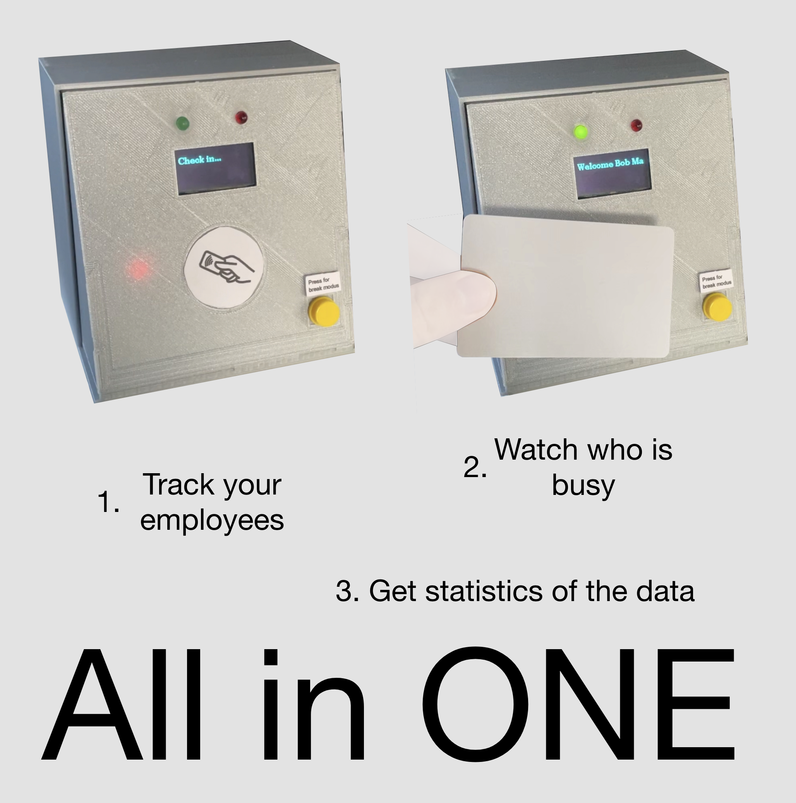
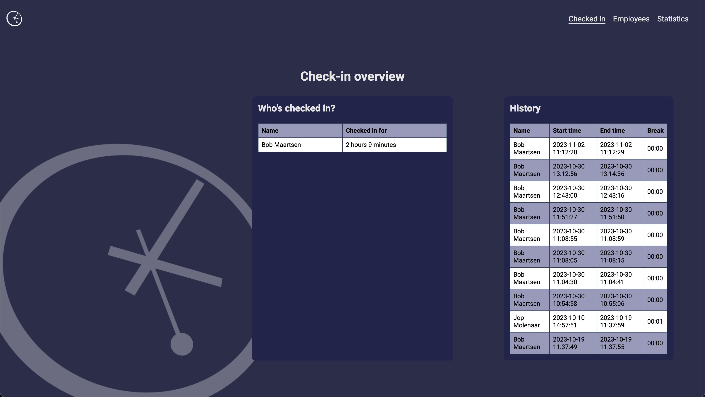
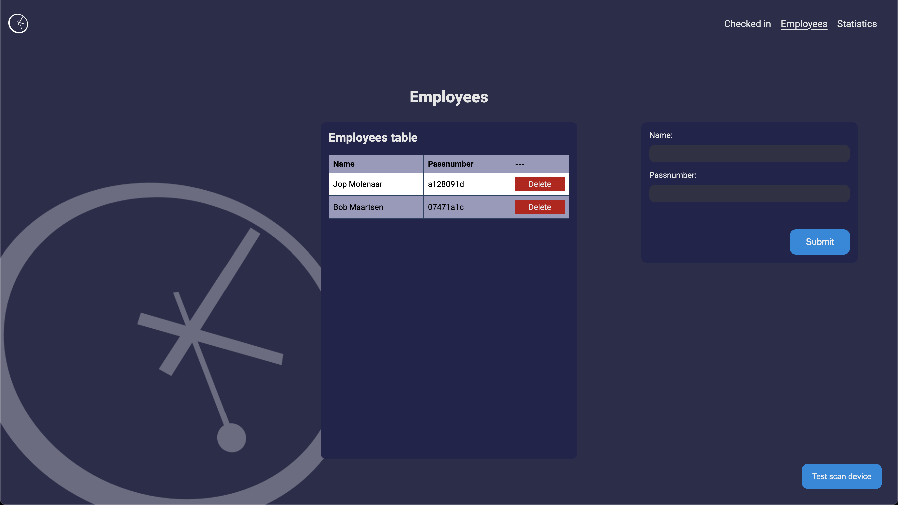
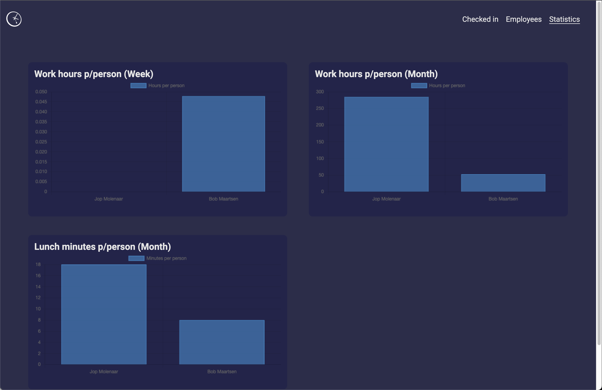

# Time registration

<!-- Describe the purpose of your blueprint. Design a nice front-page image that will describe your product. -->

For my minor IoT I have to make a propuct based on a blueprint that has sensors, uses data, data visualisation and many more things to give something usefull to the user. There where some topics that I had to chose from and I have chosen for the topic "time registration". I made a device that that tracks your shift times for a company. The employee has to check in and out when he/she is starting or ending the shift. If you want to get a break you simply push the button on the device and scan your card. And you do the same when you get back from your break. The oled screen on the device shows some text and the LED's above the oled show the status of your check in/out.

{{ mdocotion_header('https://images.unsplash.com/photo-1550745165-9bc0b252726f?ixlib=rb-4.0.3&ixid=M3wxMjA3fDB8MHxwaG90by1wYWdlfHx8fGVufDB8fHx8fA%3D%3D&auto=format&fit=crop&w=2670&q=80') }}
